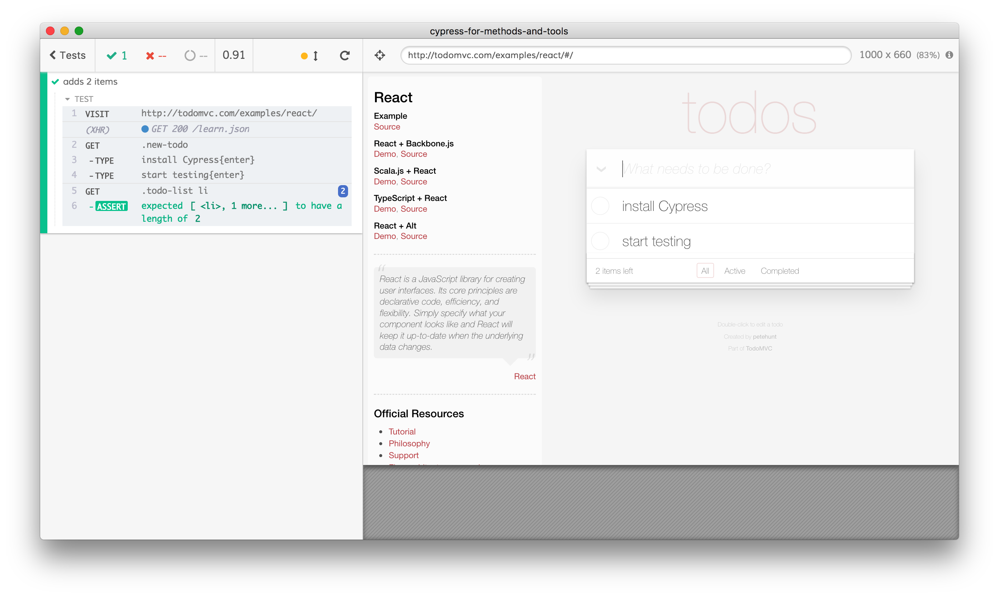
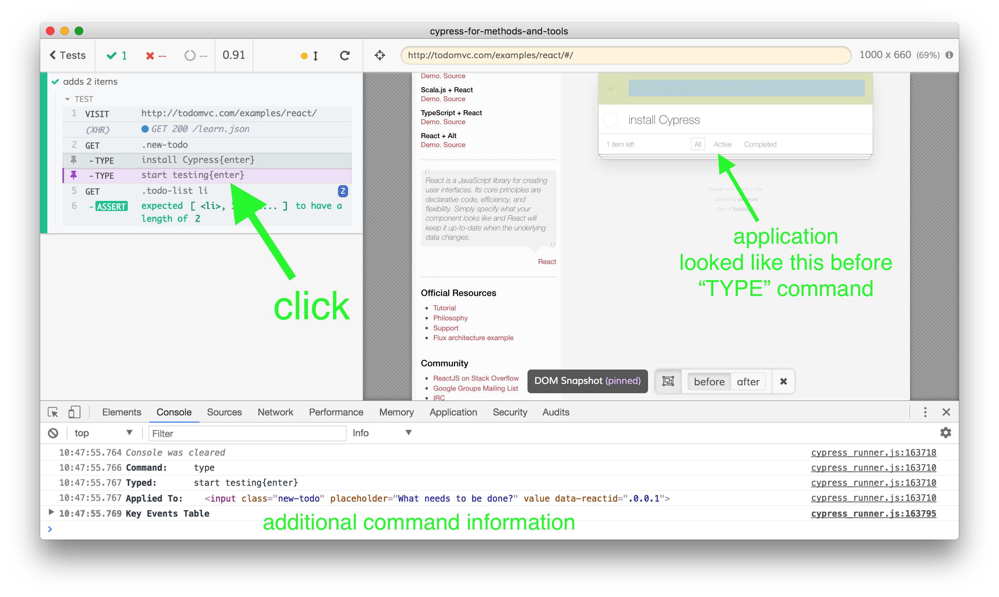
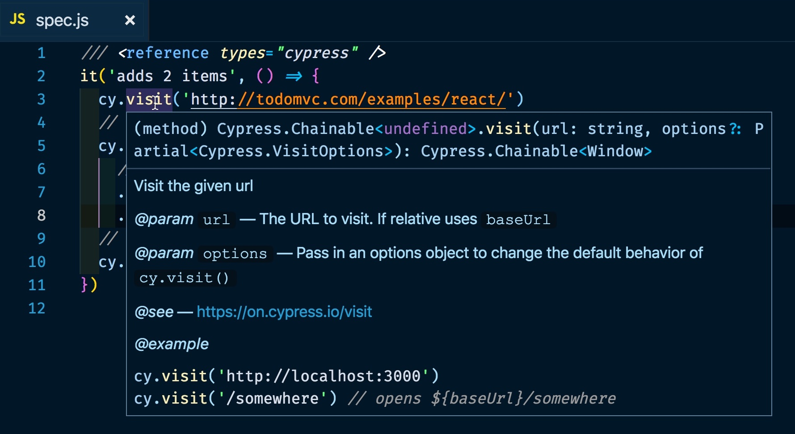

Cypress.io is a cross-platform end-to-end test runner for anything that runs in a browser. Its architecture is unique wherein the tests run alongside the application inside the browser, which allows the tests to closely control and observe the application.

- Website: https://www.cypress.io/
- Version tested: 3.1.5 on Mac OS
- System requirements: Mac / Windows / Linux
- License & Pricing: Free and open source under MIT License
- Support: Excellent documentation, forums, commercial support also available

## Installation

While you can download Cypress as a standalone application, we recommend using Node.js and NPM to install it for each project. From the terminal, with Node v4+ run

```shell
npm install cypress
```

The above command installs the Cypress NPM module, and downloads and unzips the Cypress application binary. Now you can open the Cypress GUI using one of the following equivalent commands

```shell
./node_modules/.bin/cypress open
$(npm bin)/cypress open
npx cypress open
```

On the very first run, Cypress will scaffold example test files and support folders


The most important information to take away from all of this: all the test files by default are stored in `cypress/integration` folder, and all global Cypress configuration values are stored in `cypress.json` file.

## First test

Let us write our first end-to-end test. For example, there is a TodoMVC implementation at [http://todomvc.com/examples/react/](http://todomvc.com/examples/react/). We can write a test that confirms that we can add 2 items. I will type the following in `cypress/integration/spec.js`

```js
it('adds 2 items', () => {
  cy.visit('http://todomvc.com/examples/react/')
  // finds element with class "new-todo"
  cy.get('.new-todo')
    // and types two items, like a real user
    .type('install Cypress{enter}')
    .type('start testing{enter}')
  // finds list elements and asserts that there are two of them
  cy.get('.todo-list li').should('have.length', 2)
})
```

Cypress opens a real browser and runs the test



If you hover over each step of the test in the Command Log on the left side, you will see plenty of information about the command and the application at that moment. It is part of the built-in time-traveling debugger. You can also click on each command, and additional information about the command will be printed into the DevTools console.



The wealth of information for each command allows users to debug failing tests really quickly.

## Organizing tests

Developers seem to love writing Cypress tests and watching them run. This is mainly because the test runner watched the spec files and reruns on changes, but also because the tests can quickly describe all the features of the web application that need to be tested. As the number of tests grows, they can be grouped and organized in many ways. Here are some common patterns to consider:

You can move all common steps like visiting the website into a `beforeEach` function.

```js
beforeEach(() => {
  cy.visit('http://todomvc.com/examples/react/')
})
it('adds 2 items', () => {
  // the application page has been opened
  ...
})
```

Cypress can open web applications running at any URL, so we stop hardcoding it in our application and move it into `cypress.json` configuration file

```json
{
  "baseUrl": "http://todomvc.com/examples/react/"
}
```

From the test we need to visit `/`

```js
beforeEach(() => {
  cy.visit('/')
})
it('adds 2 items', () => {
  // the application page has been opened
  ...
})
```

We can even run our tests against a different URL by changing it via command line or environment variable. For example, if the TodoMVC application is running locally at port 3000 we can open Cypress and set `baseUrl` to the local host.

```shell
CYPRESS_baseUrl=http://localhost:3000 npx cypress open
```

Every test should set the data it needs before the test starts. Do not assume that the previous test has prepared the state or cleaned up after itself - this makes tests dependent on each other. Instead, reset the data and the server before each test. For example, we might need to execute a HTTP call to the API to reset the data before each test

```js
beforeEach(() => {
  // cy.request makes HTTP call, in this case
  // we assume the server resets the data
  // on POST /api/reset call
  cy.request('POST', '/api/reset')
  cy.visit('/')
})
it('adds 2 items', () => {
  // the application page has been opened
  ...
})
```

As number of tests grows, we might need to group tests around each feature. Cypress uses the [Mocha](https://mochajs.org/) test runner engine, which allows grouping tests inside suites using `describe` or `context` function calls. For each suite, we can define `beforeEach` hooks to set the data

```js
describe('TodoMVC', () => {
  beforeEach(() => {
    cy.request('POST', '/api/reset')
  })

  // all tests that exercise "Adding items" feature
  context('New items', () => {
    it('adds 2 items', () => { ... })
    it('adds same item', () => { ... })
    ...
  })

  // all tests that exercise "Marking item completed" feature
  context('Completing items', () => {
    beforeEach(() => {
      // to test completing items we need a few items to exist
      cy.get('.new-todo').type('first{enter}').type('second{enter}')
    })
    it('toggles an item', () => { ... })
    it('toggles an item twice', () => { ... })
    ...
  })
})
```

The example repository [cypress-example-todomvc](https://github.com/cypress-io/cypress-example-todomvc) shows multiple tests organized according to this principle. There are tests for adding items, toggling them, routing and clearing completed items.

Cypress tests are written in JavaScript - because it is the language in the web applications that the browser understands. Cypress comes with a bundler too, so you can organize the test code in a clear maintainable way. For example, you can move all page selectors into a single file, or use the Page Object model to standardize all test actions. You can also extend Cypress `cy` object with your own custom commands. In many tests we might need to add todo items, so lets made a new `cy.addItem` command:

```js
Cypress.Commands.add('addItem', (text) => {
  cy.get('.new-todo').type(`${text}{enter}`)
})
it('adds 2 items', () => {
  cy.addItem('install Cypress')
  cy.addItem('start testing')
  cy.get('.todo-list li').should('have.length', 2)
})
```

You can find more details and documentation in the [Writing and Organizing Tests](https://on.cypress.io/writing-and-organizing-tests) guide.

## Continuous Integration

Working with the application and end-to-end tests locally is nice, but running the same tests on CI is very important too. Cypress can run on all major CI platforms, as described in the [continuous integration](https://on.cypress.io/continuous-integration) documentation. We even provide the [official  Docker images](https://on.cypress.io/docker) with all operating system dependencies you can use with your CI system.

On CI we should use `cypress run` command to run Cypress tests in headless mode. If a test fails, Cypress takes a screenshot of the application at that instant and saves an image automatically. Plus, Cypress captures a video of the entire run as a movie file - on every platform without anything else to install. Here is a typical video from [cypress-example-todomvc](https://github.com/cypress-io/cypress-example-todomvc) test run on CircleCI


We recommend running end-to-end tests on every commit.

## Documentation

Cypress test runner is built on tools widely used in JavaScript world: Mocha for the test syntax, jQuery for element selection, Chai for assertions and Sinon.js for spying and stubbing method calls. In addition, Cypress own command API is extensive (over 80 commands like [`cy.type`](https://on.cypress.io/type) and [`cy.click`](https://on.cypress.io/click)) and is very well documented at [https://docs.cypress.io](https://docs.cypress.io). There is also a large number of tutorials, best practices, trade-offs discussion and other learning resources for anyone interested in or already using Cypress.io.

If you are just starting with Cypress, and you are using a modern text editor like VSCode, we advise to add the following special comment line to your JavaScript test file.

```js
/// <reference types="cypress" />
```

This special comment is understood by many code editors, and it turns on intelligent code completion based on the method types we ship with Cypress. For example, when hovering on `cy.visit` method call in my test I will see what the command does, a short example and a link to the full command documentation page.



Everyone starting with Cypress should be able to write useful tests quickly, thanks to these popups and documentation.

## Key trade-offs

Cypress architecture makes some things really simple, like controlling the application running inside the browser, or spying on the network calls the application is making to the server. To make these features possible, there are certain major limitations that are currently in place:

- tests are limited to a single super domain; which makes login via social providers difficult.
- only Chromium-based browsers are currently supported, but the work to support IE11 and Firefox is ongoing

You can read more about current trade-offs at [Trade-offs](https://on.cypress.io/trade-offs) and on [Key Differences](https://on.cypress.io/key-differences).

## Paid services

The Cypress.io test runner is [free and will always be free and open source](https://on.cypress.io/general-questions-faq#Is-Cypress-free-and-open-source). There are no feature limitations or special plugins to purchase; you can run all tests and export screenshots, videos and test results into any reporting format for your own system.

As a company, Cypress.io makes money from an additional, completely optional SaaS service that collects and presents test results in a convenient format. This is called the [Cypress Dashboard](https://on.cypress.io/dashboard-service), and it can be quite helpful for enterprise customers. The Dashboard also provides test load balancing, historical test analytics, GitHub integration, and other services.

You can also subscribe to premium support from Cypress engineers.

## More information

To learn more about the Cypress.io test runner and the company services, check out the following links

- https://www.cypress.io
- https://docs.cypress.io
- https://github.com/cypress-io/cypress

You can also follow our [Twitter @cypress_io](https://twitter.com/cypress_io) to get the latest news and updates.
